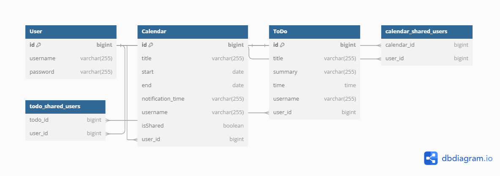

<h2>$\huge{\rm{\color{	
#4682B4}ToDoList And Calendar App}}$</h2>

## <span style="color:#4682B4">목차</span>

- [프로젝트 소개](#프로젝트-소개)
- [APP 설명](#APP-설명)
- [소스 빌드 및 실행 방법 메뉴얼](#소스-빌드)
- [주력으로 사용한 컨트롤러에 대한 설명](#설명)
- [API 명세서](#API)

<br/>
<br/>
<h3 id="프로젝트-소개">$\huge{\rm{\color{	
#4682B4}프로젝트-소개}}$</h3>
<br/>
- 내가 할일 을 저장하는 ToDoList 와 일정 관리 캘린더로 이용하는 Calendar-App 을 만들었습니다.
<br/>
<br/>
- ToDoList 와 Calendar 앱은 하나의 리액트 앱에서 진행하되 각 컴포넌트를 나눠서 버튼식으로 나눠서 진행하였습니다.
<br/>
<br/>
- 자세한 설명은 Front-End 폴더 안에 README에서 설명드리고 여기선 Back-End 에 대한 설명을 드리겠습니다.
<br/>
<br/>
- Back-End는 SpringBoot v3 을 이용하였습니다. 프레임워크 툴은 IntelliJ IDEA를 사용하였습니다.
<br/>
<br/>

<br/>
<br/>

<p id="APP-설명">$\huge{\rm{\color{#4682B4}APP-설명}}$</p>

- **ToDoList**: ToDoList는 간단하게 제목, 작업 요약, 그리고 그 일을 해야할 시간을 넣었습니다. 그리고 컨트롤러에는 ToDo 생성, List불러오기, 삭제 API를 만들었습니다.
- **Calendar**: Calandar 앱은 일정추가 에 일정 제목, 시작하는 날짜 부터 끝나는 날짜까지 기간을 정할 수 있고, 알림을 띄울 수 있는 시간을 정할 수 있게 해두었습니다
  또한 일정 수정 기능, 일정 목록을 한번에 볼수 있는 기능을 넣어 두었습니다. 
- **Share Controller**: 각 ToDoList와 Calendar 앱은 사용자들의 username을 검색하여 해당 사용자에게 본인이 공유하고 싶은 일정을 공유할 수 있습니다. 해당 기능은 DB의 Join 기능을 수행하여 처리 하였습니다.
<br/>
<br/>
<br/>
<br/>
<p id="소스-빌드">$\huge{\rm{\color{#4682B4}소스-빌드-및-실행-방법-메뉴얼}}$</p>

인텔리제이 IDEA 에서 소스 빌드 해주시길 바랍니다.

```bash
git clone https://github.com/Scarpula/Project_Clush.git
# IntelliJ 내부 터미널에서 git Clone 받으시고
# application 실행이나, SpringBoot 서버 실행으로 실행하시면 됩니다.
```

이후 cd src/main/Front-End 에 들어가서 npm install 해주시고 
Spring 서버 키신 후에 npm start 하셔서 port번호 3000번에서 
로그인 하시고 진행 하시면 됩니다.

회원 가입은 진행하지 않기 때문에 테스트용 아이디 
# test1 , 12345
# test2 , 12345 
의 아이디를 이용하여 테스트 해주시면 감사하겠습니다.

※ 로그인을 하지 않고 실행 할 경우 403 에 걸릴 수 있습니다.※
※ 반드시 로그인 하시고 테스트 부탁드리겠습니다.※

# ToDoList
1. 일정을 추가해보세요
2. 일정을 클릭해서 상세보기를 확인 해보세요
3. 삭제기능을 사용해보세요
4. 일정 공유하기 기능을 사용해보세요
   1. 사용자를 검색합니다. ex) test1 아이디로 로그인 했을 경우
   2. test2를 검색합니다.
   3. 하단에 공유를 원하는 작업을 선택합니다.
   4. 작업 공유를 하면 test2로 로그인 했을때 공유한 작업이 나옵니다.

# Calendar
1. day를 클릭하여 일정을 추가해보세요
2. day를 drag 해서 일정기간 설정하여 일정을 추가해보세요
3. 추가된 일정을 눌러서 일정을 수정해보세요
4. 공유된 일정의 경우 상대 user에게도 수정된 일정으로 바뀝니다.
5. 일정을 삭제해보세요
   1. 공유된 일정은 삭제버튼을 누를경우 403 이 나옵니다.
6. 일정 공유 기능을 사용해보세요
   1. 사용자를 검색합니다. ex) test1 아이디로 로그인 했을 경우
   2. test2를 검색합니다.
   3. 하단에 공유를 원하는 작업을 선택합니다.
   4. 작업 공유를 하면 test2로 로그인 했을때 공유한 작업이 나옵니다.

<br/>
<br/>
<br/>
# ERD Diagram



<br/>
<br/>

<p id="설명">$\huge{\rm{\color{#4682B4}주력으로-사용한-컨트롤러에-대한-설명}}$</p>
<br/>

## 1. ShareController 설명

1. **사용자 검색 기능 (`searchUser`)**  
   특정 사용자를 검색하여, 공유할 대상 사용자가 존재하는지 확인합니다. 사용자가 없을 경우 `404` 에러를 반환하여 사용자에게 명확한 피드백을 제공합니다.

    ```java
    @GetMapping("/search")
    public ResponseEntity<?> searchUser(@RequestParam String username) {
        Optional<User> user = userService.findByUsername(username);
        if (user.isEmpty()) {
            return ResponseEntity.status(404).body("사용자를 찾을 수 없습니다.");
        }
        return ResponseEntity.ok(user.get());
    }
    ```

2. **일정 공유 기능 (`shareCalendar`)**  
   사용자가 소유한 일정을 다른 사용자에게 공유할 수 있는 기능입니다. 로그인 상태를 확인하고, 공유 대상 사용자가 존재하는지 확인한 뒤, 일정을 소유한 사용자인지 검증하여 권한이 없는 경우 `403` 에러를 반환함으로써 보안성을 강화합니다.

    ```java
    @PostMapping("/calendar/{calendarId}/share")
    public ResponseEntity<?> shareCalendar(@PathVariable Long calendarId, @RequestParam String username, HttpSession session) {
        User loggedUser = (User) session.getAttribute("user");
        if (loggedUser == null) {
            return ResponseEntity.status(401).body("로그인 후 사용 가능합니다.");
        }
        Optional<User> targetUser = userService.findByUsername(username);
        if (targetUser.isEmpty()) {
            return ResponseEntity.status(404).body("공유할 사용자를 찾을 수 없습니다.");
        }
        Calendar calendar = userService.getCalendarById(calendarId);
        if (calendar == null || !calendar.getUser().getId().equals(loggedUser.getId())) {
            return ResponseEntity.status(403).body("일정을 공유할 권한이 없습니다.");
        }
        shareService.shareCalendarWithUser(calendar, targetUser.get());
        return ResponseEntity.ok("일정이 성공적으로 공유되었습니다.");
    }
    ```

3. **할 일 공유 기능 (`shareTodo`)**  
   일정 공유와 유사하게, 사용자가 소유한 할 일을 다른 사용자에게 공유할 수 있는 기능입니다. 사용자의 로그인 상태와 할 일 소유 여부를 체크하여, 허용되지 않은 공유를 방지합니다.

    ```java
    @PostMapping("/todo/{todoId}/share")
    public ResponseEntity<?> shareTodo(@PathVariable Long todoId, @RequestParam String username, HttpSession session) {
        User loggedUser = (User) session.getAttribute("user");
        if (loggedUser == null) {
            return ResponseEntity.status(401).body("로그인 후 사용 가능합니다.");
        }
        Optional<User> targetUser = userService.findByUsername(username);
        if (targetUser.isEmpty()) {
            return ResponseEntity.status(404).body("공유할 사용자를 찾을 수 없습니다.");
        }
        ToDo todo = userService.getToDoById(todoId);
        if (todo == null || !todo.getUser().getId().equals(loggedUser.getId())) {
            return ResponseEntity.status(403).body("할 일을 공유할 권한이 없습니다.");
        }
        shareService.shareToDoWithUser(todo, targetUser.get());
        return ResponseEntity.ok("할 일이 성공적으로 공유되었습니다.");
    }
    ```

4. **일정 조회 기능 (`getAllCalendars`)**  
   로그인한 사용자가 소유한 일정과 다른 사용자로부터 공유받은 일정을 모두 조회할 수 있는 기능입니다. 이를 통해 사용자는 자신이 공유받은 일정을 손쉽게 확인할 수 있습니다.

    ```java
    @GetMapping("/calendars")
    public ResponseEntity<?> getAllCalendars(HttpSession session) {
        User loggedUser = (User) session.getAttribute("user");
        if (loggedUser == null) {
            return ResponseEntity.status(401).body("로그인 후 사용 가능합니다.");
        }
        List<CalendarDTO> calendarDTOs = shareService.getAllCalendarsForUser(loggedUser);
        return ResponseEntity.ok(calendarDTOs);
    }
    ```

5. **할 일 조회 기능 (`getAllTodos`)**  
   로그인한 사용자가 소유한 할 일과 다른 사용자로부터 공유받은 할 일을 조회할 수 있습니다. 이 기능은 일정 조회와 유사하게 동작하며, 공유받은 할 일을 필터링하여 반환하여 사용자가 필요한 정보만 얻을 수 있도록 합니다.

    ```java
    @GetMapping("/todos")
    public ResponseEntity<?> getAllTodos(HttpSession session) {
        User loggedUser = (User) session.getAttribute("user");
        if (loggedUser == null) {
            return ResponseEntity.status(401).body("로그인 후 사용 가능합니다.");
        }
        List<ToDo> todos = shareService.getAllToDosForUser(loggedUser);
        List<TodoDTO> sharedTodoDTOs = todos.stream()
                .filter(todo -> !todo.getUser().getUsername().equals(loggedUser.getUsername()))
                .map(todo -> new TodoDTO(
                        todo.getId(),
                        todo.getTitle(),
                        todo.getSummary(),
                        todo.getTime(),
                        todo.getUser().getUsername()
                ))
                .collect(Collectors.toList());
        return ResponseEntity.ok(sharedTodoDTOs);
    }
    ```

### 요약
`ShareController`는 사용자 간의 협업을 위한 주요 기능을 제공하며, 보안과 사용 편리성을 고려한 설계로 사용자에게 명확한 피드백과 안전한 데이터 공유를 지원합니다.

## 2. 사용 이유 및 목적

- **협업 기능 제공**: `ShareController`는 일정과 할 일을 사용자 간에 공유할 수 있는 기능을 제공하여 협업과 커뮤니케이션을 원활하게 만듭니다. 이 기능은 팀 작업, 프로젝트 관리, 가족 간의 일정 공유 등 다양한 상황에서 매우 유용하게 사용될 수 있습니다.

- **보안성과 권한 검증**: 각 기능은 사용자의 로그인 상태와 일정/할 일의 소유 여부를 철저하게 검증하여, 민감한 데이터가 허가되지 않은 사용자에게 노출되지 않도록 합니다. 이를 통해 애플리케이션의 보안성을 높이고, 사용자 신뢰를 유지할 수 있습니다.

- **유연한 데이터 처리**: 일정과 할 일 데이터를 DTO로 변환하여 필요한 정보만 제공하고, 불필요한 정보의 노출을 방지합니다. 이는 클라이언트와의 데이터 통신을 효율적으로 만들며, 유지보수의 용이성을 높입니다.

- **사용자 경험 강화**: 에러 발생 시 적절한 HTTP 상태 코드와 메시지를 제공하여, 사용자에게 명확한 피드백을 줌으로써 애플리케이션의 사용성을 높입니다. 사용자 친화적인 오류 처리로 인해 서비스의 신뢰성이 증가합니다.

이러한 이유로 `ShareController`는 일정과 할 일 공유 API의 핵심적인 역할을 수행하며, 전체 애플리케이션에서 중요한 기능을 제공합니다. 사용자 간의 협업을 촉진하고, 안전한 데이터 처리를 보장하여 서비스의 가치를 높이는 데 기여합니다.

<br/>
<br/>
<br/>
<p id="API">$\huge{\rm{\color{#4682B4}API-명세서}}$</p>
<br/>

# API Documentation

이 프로젝트는 Swagger를 사용하여 API 명세를 제공합니다. Swagger UI를 통해 API를 테스트하고, 각 엔드포인트에 대한 자세한 정보를 확인할 수 있습니다.

## Swagger UI 접속 방법

1. 프로젝트를 실행합니다.
2. 웹 브라우저를 열고 아래 주소로 접속합니다:
http://localhost:8083/swagger-ui.html
3. Swagger UI에서 API 명세를 확인하고, 각 API를 테스트할 수 있습니다.

## 주요 기능

- **API 명세 확인**: Swagger UI를 통해 모든 API 엔드포인트의 명세를 확인할 수 있습니다.
- **API 테스트**: 각 API 엔드포인트를 직접 테스트하여 요청과 응답을 확인할 수 있습니다.
- **명확한 문서 제공**: 각 엔드포인트에 대한 설명, 요청 파라미터, 응답 코드 등을 시각적으로 제공합니다.


